# Architecture Overview

`RawInputMonitor` is built on a high-performance, non-blocking Win32 message pump designed to ingest input with zero driver dependencies.

## System Diagram

```mermaid
graph TB
    subgraph "Physical Devices"
        TW["Tangent Wave 2<br/>04D8:FDCF"]
        SM["SpaceMouse<br/>046D:* / 256F:*"]
        SB["Slimblade Pro<br/>047D:80D4"]
        AB["Arturia BeatStep Pro<br/>1C75:0287"]
    end

    subgraph "RawInputMonitor.exe (C# .NET 9)"
        MP["Message Pump<br/>(hidden window + WM_INPUT)"]
        MM["MIDI Manager<br/>(winmm.dll P/Invoke)"]
        DM["Device Manager<br/>(enumerate, track, hotplug)"]
        HD["HID Decoder<br/>(device profiles)"]
        WS["WebSocket Server<br/>(localhost:9100)"]
    end

    subgraph "Browser Dashboard"
        UI["index.html<br/>(device panels + live values)"]
    end

    TW --> MP
    SM --> MP
    SB --> MP
    AB -->|"USB MIDI"| MM
    MP --> DM
    MM -->|"InputEvent"| DM
    DM --> HD
    HD --> WS
    WS -->|"JSON over ws://"| UI
```

## Threading Model

| Thread | Responsibility |
|--------|---------------|
| **Main Thread** | Win32 message pump (`GetMessage` loop). Receives all `WM_INPUT` and `WM_INPUT_DEVICE_CHANGE` messages. Must be the thread that creates the window and registers devices. |
| **winmm Callback Thread** | System-managed thread that delivers MIDI input messages to `MidiManager.MidiCallback`. Enqueues `InputEvent` records into the shared queue. |
| **WebSocket Thread** | `HttpListener` accepting connections and broadcasting JSON to all connected clients. |
| **Shared State** | `ConcurrentQueue<InputEvent>` bridges both the message pump and MIDI callback to the WebSocket broadcaster. Lock-free, thread-safe. |

## Core Components

- **Win32 Message Pump**: A hidden window (`MessageWindow.cs`) registers for raw input and captures `WM_INPUT` efficiently without requiring window focus.
- **Device Manager**: Enumerates HID devices on startup, handles hot-plugging, routes `RAWHID` or `RAWMOUSE` payloads to the correct profile, and accepts externally registered MIDI devices.
- **MIDI Manager**: Opens MIDI input/output ports via `winmm.dll` P/Invoke. Decodes short messages (Note On/Off, CC, Pitch Bend, Transport) and SysEx long messages. Sends Note On feedback for LED control.
- **Profile Decoder**: Converts raw hex arrays into normalized `InputEvent` records. Specific profiles (like `TangentWaveProfile`) handle vendor-defined mappings. Unmatched HID devices are handled by a generic fallback profile.
- **WebSocket Broadcaster**: Streams the decoded event JSON to connected web clients for real-time visualization.
