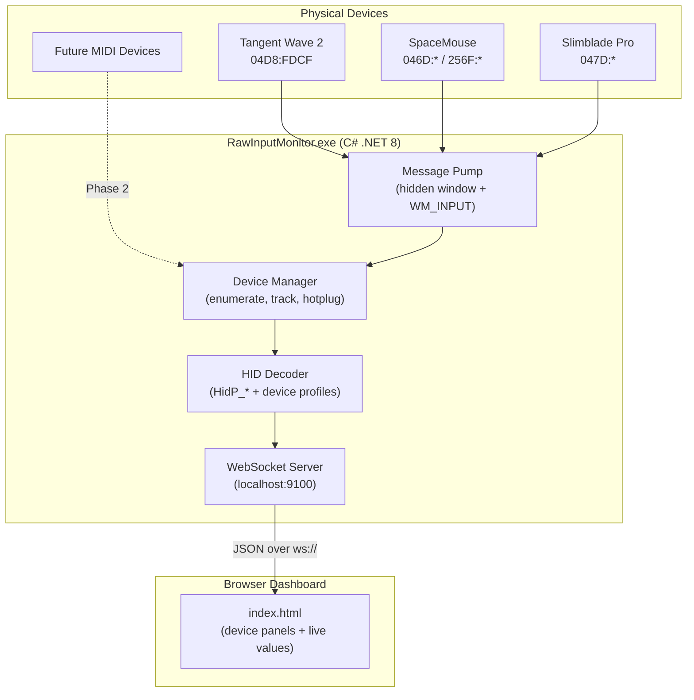

# RawInputMonitor — Implementation Plan

A ground-up C# application that captures **all** HID input reports via Windows Raw Input API, decodes them into named values, and streams them to a real-time browser dashboard over WebSocket.

## Scope

- **Pure Raw Input API** — no third-party HID libraries
- **All connected HID devices visible by default** — not filtered to specific devices
- **3 priority devices with dedicated profiles:** Tangent Wave 2 (`04D8:FDCF`), SpaceMouse (3Dconnexion `046D:*` / `256F:*`), Slimblade Pro (Kensington `047D:*`)
- **MIDI-ready architecture from day one** — the event model and dashboard accommodate both HID and MIDI input sources
- **Browser dashboard** on `localhost:9100` for real-time monitoring
- **General purpose** — a universal input broker, not tied to any specific application

---

## Architecture



### Threading Model

| Thread | Responsibility |
|--------|---------------|
| **Main Thread** | Win32 message pump (`GetMessage` loop). Receives all `WM_INPUT` and `WM_INPUT_DEVICE_CHANGE` messages. Must be the thread that creates the window and registers devices. |
| **WebSocket Thread** | `HttpListener` accepting connections and broadcasting JSON to all connected clients. |
| **Shared State** | `ConcurrentQueue<InputEvent>` bridges the message pump to the WebSocket broadcaster. Lock-free, thread-safe. |

---

## Project Structure

```
RawInputMonitor/
├── RawInputMonitor.csproj
├── Program.cs                        ← Entry point, orchestrates startup
│
├── Win32/
│   ├── RawInputInterop.cs            ← P/Invoke: RegisterRawInputDevices, GetRawInputData,
│   │                                    GetRawInputDeviceInfo, GetRawInputDeviceList
│   ├── HidPInterop.cs                ← P/Invoke: HidP_GetCaps, HidP_GetValueCaps,
│   │                                    HidP_GetUsageValue, HidP_GetButtonCaps
│   └── MessageWindow.cs              ← Hidden message-only window + message pump
│
├── Core/
│   ├── DeviceManager.cs              ← Enumerate devices, track connect/disconnect
│   ├── HidReportDecoder.cs           ← Generic HID report decoder using HidP_* preparsed data
│   ├── InputEvent.cs                 ← Normalized event model (device, channel, value, source type)
│   └── DeviceInfo.cs                 ← Device metadata (VID, PID, name, path, capabilities)
│
├── Profiles/
│   ├── IDeviceProfile.cs             ← Interface: byte[] → List<InputEvent>
│   ├── TangentWaveProfile.cs         ← Tangent Wave 2 byte-offset → named controls
│   ├── SpaceMouseProfile.cs          ← SpaceMouse report ID → 6DOF axes + buttons
│   ├── SlimbladeProfile.cs           ← Slimblade X/Y/buttons/scroll mapping
│   └── GenericHidProfile.cs          ← Fallback: uses HidP_* for any standard HID device
│
├── Server/
│   └── WebSocketServer.cs            ← HttpListener + WebSocket broadcast + static file serving
│
└── Dashboard/
    ├── index.html                    ← Single-page dashboard
    ├── style.css                     ← Dark theme, device panels
    └── app.js                        ← WebSocket client, live rendering
```

---

## Proposed Changes

### Phase 1: Project Scaffold + Win32 Interop

#### [NEW] RawInputMonitor.csproj

- .NET 8.0 console app, Windows-only (`<TargetFramework>net8.0-windows</TargetFramework>`)
- **Zero NuGet dependencies.** All Win32 access via manual P/Invoke.
- Uses built-in `System.Net.WebSockets`, `System.Text.Json`

#### [NEW] Win32/RawInputInterop.cs

Full P/Invoke declarations for `user32.dll`:

| Function | Purpose |
|----------|---------|
| `RegisterRawInputDevices` | Tell Windows to send us WM_INPUT for specified device classes |
| `GetRawInputData` | Extract the RAWINPUT struct from a WM_INPUT message |
| `GetRawInputDeviceList` | Enumerate all connected Raw Input devices |
| `GetRawInputDeviceInfo` | Get device name, VID/PID, and preparsed data |
| `CreateWindowEx` | Create the hidden message-only window |
| `RegisterClassEx` | Register the window class |
| `GetMessage` / `TranslateMessage` / `DispatchMessage` | Message pump |
| `DefWindowProc` | Default window procedure |

Supporting structs: `RAWINPUTDEVICE`, `RAWINPUT`, `RAWINPUTHEADER`, `RAWHID`, `RAWMOUSE`, `RAWINPUTDEVICELIST`, `RID_DEVICE_INFO`, `WNDCLASSEX`, `MSG`

#### [NEW] Win32/HidPInterop.cs

P/Invoke declarations for `hid.dll` (Windows built-in, no install needed):

| Function | Purpose |
|----------|---------|
| `HidP_GetCaps` | Get device capabilities (number of buttons, values, report sizes) |
| `HidP_GetValueCaps` | Get metadata for each value field (usage page, usage, bit size, min/max) |
| `HidP_GetButtonCaps` | Get metadata for button fields |
| `HidP_GetUsageValue` | Extract a specific value from a raw report by usage |
| `HidP_GetUsages` | Extract which buttons are currently pressed |

Supporting structs: `HIDP_CAPS`, `HIDP_VALUE_CAPS`, `HIDP_BUTTON_CAPS`

#### [NEW] Win32/MessageWindow.cs

- Creates a **message-only window** (`CreateWindowEx` with `HWND_MESSAGE` parent)
- Registers for Raw Input on **all HID device classes**:
  - Usage Page `0x01`, Usage `0x02` (Mouse) — for Slimblade
  - Usage Page `0x01`, Usage `0x04` (Joystick) — for SpaceMouse
  - Usage Page `0x01`, Usage `0x05` (Gamepad)
  - Usage Page `0x01`, Usage `0x08` (Multi-axis Controller) — for SpaceMouse
  - Vendor-defined pages — for Tangent Wave
  - Flags: `RIDEV_INPUTSINK` (receive input even when not focused) + `RIDEV_DEVNOTIFY` (hotplug notifications)
- Window procedure dispatches `WM_INPUT` → callback, `WM_INPUT_DEVICE_CHANGE` → callback
- `Run()` blocks on the `GetMessage` loop
- The `WndProc` delegate **must be stored as a field** to prevent garbage collection

---

### Phase 2: Device Manager

#### [NEW] Core/DeviceInfo.cs

```csharp
class DeviceInfo
{
    string DevicePath;
    IntPtr DeviceHandle;
    ushort VendorId;
    ushort ProductId;
    string Manufacturer;
    string ProductName;
    string SourceType;          // "HID", "MIDI" (future-ready)
    IntPtr PreparsedData;       // for HidP_* calls
    HIDP_CAPS Capabilities;
    IDeviceProfile Profile;     // resolved at registration time
    bool IsConnected;
}
```

#### [NEW] Core/DeviceManager.cs

- On startup: `GetRawInputDeviceList` → enumerate all devices
- For each device: `GetRawInputDeviceInfo` with `RIDI_DEVICENAME` (path), `RIDI_DEVICEINFO` (VID/PID), `RIDI_PREPARSEDDATA` (for HidP_*)
- Resolves the appropriate `IDeviceProfile` by VID/PID match (specific profiles first, `GenericHidProfile` as fallback)
- Maintains `Dictionary<IntPtr, DeviceInfo>` keyed by device handle for O(1) lookup per `WM_INPUT`
- Handles device arrival/removal via `WM_INPUT_DEVICE_CHANGE`
- `ProcessRawInput(IntPtr lParam)`:
  1. `GetRawInputData` → `RAWINPUT` struct
  2. Look up device by `header.hDevice`
  3. Route to profile's `Decode()` method
  4. Enqueue resulting `InputEvent` objects to `ConcurrentQueue`

---

### Phase 3: HID Decoder + Device Profiles

#### [NEW] Core/InputEvent.cs

```csharp
record InputEvent
{
    string DeviceId;        // "04D8:FDCF"
    string DeviceName;      // "Tangent Wave 2"
    string SourceType;      // "HID" or "MIDI" (future-ready)
    string Channel;         // "Dial1", "TX", "Button3", "CC:7", etc.
    double Value;           // Normalized or raw
    double RawValue;        // Always the raw integer
    long Timestamp;         // Unix ms, high-resolution
}
```

> [!NOTE]
> The `SourceType` and `Channel` naming convention is designed to accommodate MIDI from day one. HID channels use descriptive names (`Dial1`, `TX`). Future MIDI channels will use `CC:N`, `Note:N`, `PitchBend`, etc.

#### [NEW] Profiles/IDeviceProfile.cs

```csharp
interface IDeviceProfile
{
    bool CanHandle(ushort vendorId, ushort productId);
    string FriendlyName { get; }
    IEnumerable<InputEvent> Decode(byte[] report, int count, DeviceInfo device);
    IEnumerable<InputEvent> DecodeMouse(RAWMOUSE mouse, DeviceInfo device);
}
```

Two decode paths: `Decode()` for HID reports (`RAWHID` data), `DecodeMouse()` for mouse-class devices (`RAWMOUSE` data). The Slimblade arrives as mouse data, not generic HID.

#### [NEW] Profiles/GenericHidProfile.cs

- Fallback for any unrecognized HID device
- Uses `HidP_GetValueCaps` to enumerate all value fields in the report
- Uses `HidP_GetUsageValue` to extract each value per report
- Uses `HidP_GetUsages` to extract active buttons
- Channel names: `"Page{X}:Usage{Y}"` format (e.g., `"GenericDesktop:X"`, `"Button:3"`)
- This ensures every HID device produces readable output even without a custom profile

#### [NEW] Profiles/TangentWaveProfile.cs

- Matches VID `04D8`, PID `FDCF`
- Vendor-defined Usage Page (`0xF000`) — no standard HID labels exist
- **Exhaustive byte-offset mapping strategy** for the 26-byte report:
  - **Trackballs (3×):** X/Y relative optical sensors
  - **Dials (4×):** 3× Master dials (one for each trackball) + 1× Jog/Transport dial (relative rotary encoders)
  - **Programmable Knobs (9×):** Relative rotary with integral push-to-reset switches
  - **Transport:** Shuttle ring, 5× Transport buttons
  - **Buttons:** 9× Programmable, 9× Function, 2× Modifier, Individual Reset buttons
- **Universal Capture:** The decoding logic will be designed to map *all* incoming bytes. Regardless of the control type ingested, any changing bytes in the raw HID report will be systematically captured, decoded, and exposed as generic channels if unmapped.
- Initial mapping will be built by running RawInputMonitor itself in "raw hex" mode and physically manipulating every single control on the device to map all byte offsets.
- *Future Phase (LCD Output):* Implement output reports using `kernel32.dll` (`CreateFile` / `WriteFile`) or `HidD_SetOutputReport` to write text to the 3× OLED displays. Requires proprietary driver uninstallation to obtain `GENERIC_WRITE` access.

#### [NEW] Profiles/SpaceMouseProfile.cs

- Matches VID `046D` or `256F` (3Dconnexion)
- Report structure (varies slightly by model, typically multi-report):
  - **Report ID 1 (Translation):** TX, TY, TZ — 3× signed 16-bit little-endian integers
  - **Report ID 2 (Rotation):** RX, RY, RZ — 3× signed 16-bit little-endian integers
  - **Report ID 3 (Buttons):** Bitmask for device buttons
- Produces channels: `TX`, `TY`, `TZ`, `RX`, `RY`, `RZ`, `Button1`..`ButtonN`
- Registers for Usage Page `0x01`, Usage `0x08` (Multi-axis Controller)

> [!WARNING]
> **3Dconnexion driver conflict.** If the 3DxWare driver/service is running, it may intercept device data at the driver level before Raw Input sees it. Two approaches to test:
> 1. Stop the `3DxService` Windows service before running RawInputMonitor
> 2. Register with `RIDEV_NOLEGACY` to suppress legacy input processing
>
> Must be tested empirically — driver behavior varies by version.

#### [NEW] Profiles/SlimbladeProfile.cs

- Matches VID `047D` (Kensington)
- Mouse-class device — Windows delivers `RAWMOUSE` struct, not `RAWHID`
- Implements `DecodeMouse()` instead of `Decode()`
- Extracts: `LastX`, `LastY` (relative movement from ball), button flags (4 physical buttons)
- **Twist-to-Scroll:** The trackball's vertical twist rotation is reported natively as standard mouse `Wheel` (scroll) delta (`WHEEL_DELTA`=120) by the hardware sensors. We normalize this to 1/-1.
- Produces channels: `X`, `Y`, `Button_BottomLeft`, `Button_BottomRight`, `Button_TopLeft`, `Button_TopRight`, `Twist_Scroll`

> [!TIP]
> **Cursor Suppression (HidHide)**: Because this is a standard mouse, it moves the OS cursor. Using the Raw Input `RIDEV_NOLEGACY` flag disables all mice on the system, which is bad. The professional solution is to use the **HidHide** kernel driver to hide the Kensington device from the OS, while whitelisting `RawInputMonitor.exe` so we can still read the raw input without moving the cursor.

---

### Phase 4: WebSocket Server

#### [NEW] Server/WebSocketServer.cs

- `HttpListener` on `http://localhost:9100/`
- **Static file serving:** HTTP GET to `/` → `index.html`, `/style.css`, `/app.js`
- **WebSocket endpoint:** HTTP GET to `/ws` → WebSocket upgrade
- Maintains `List<WebSocket>` of connected clients (thread-safe via lock)
- Background loop: drains `ConcurrentQueue<InputEvent>`, serializes to JSON via `System.Text.Json`, broadcasts to all clients
- JSON message format:
```json
{
  "type": "input",
  "device": "Tangent Wave 2",
  "deviceId": "04D8:FDCF",
  "sourceType": "HID",
  "channel": "Dial1",
  "value": 127.0,
  "raw": 127,
  "ts": 1714531200000
}
```
- Device list message (sent on connect and on hotplug):
```json
{
  "type": "deviceList",
  "devices": [
    { "deviceId": "04D8:FDCF", "name": "Tangent Wave 2", "sourceType": "HID", "connected": true },
    { "deviceId": "046D:C635", "name": "SpaceMouse Pro", "sourceType": "HID", "connected": true }
  ]
}
```
- Handles client disconnect gracefully (remove from list, dispose socket)
- Batches messages to avoid flooding the WebSocket (max ~60 pushes/second, coalesce same-channel updates)

---

### Phase 5: Browser Dashboard

#### [NEW] Dashboard/index.html

- Single-page application, no build tools, no framework — vanilla HTML/CSS/JS
- Connects to `ws://localhost:9100/ws`
- Auto-reconnect with exponential backoff

#### [NEW] Dashboard/style.css

- Dark theme, premium aesthetic
- CSS custom properties for theming
- Device panels: glassmorphism cards, one per device
- Per-channel: label, current value, value bar, min/max range indicators
- Connection status: top-bar indicator (connected/disconnected/reconnecting)
- Responsive CSS grid — adapts to number of devices

#### [NEW] Dashboard/app.js

- WebSocket client with auto-reconnect
- On `deviceList` message: creates/updates device panel cards
- On `input` message: updates the matching channel's value display
- Each device panel shows:
  - Device name + VID:PID badge + source type badge (HID / MIDI)
  - Connection status dot (green/red)
  - Per-channel row: channel name, live value, visual bar, min/max observed
  - Event rate indicator (Hz)
  - Collapsible raw hex view of last report
- Devices with custom profiles show friendly channel names; generic devices show usage-based names
- All elements have unique IDs for testability

---

## Execution Order

| Phase | What | Depends On |
|-------|------|------------|
| 1 | Project scaffold + all Win32 P/Invoke + message window | Nothing |
| 2 | Device Manager (enumerate, hotplug, preparsed data) | Phase 1 |
| 3 | HID Decoder + all device profiles | Phase 2 |
| 4 | WebSocket server + static file serving | Phase 1 |
| 5 | Browser dashboard | Phase 4 |
| **Integration** | Wire everything together in Program.cs | All phases |

Phases 3 and 4 can be built in parallel since they have no dependency on each other.

---

## Verification Plan

### Build Verification
- `dotnet build` succeeds with zero errors and zero warnings
- Single self-contained executable via `dotnet publish`

### Functional Verification (Manual)

| Test | Expected Result |
|------|----------------|
| Run with no args | Console prints all detected HID devices (VID, PID, name, path) |
| Open `http://localhost:9100/` | Dashboard loads, shows "Connecting..." then device list |
| Tangent Wave — turn each dial | Named channels (`Dial1`, `Dial2`, etc.) appear with changing values |
| SpaceMouse — push/pull/twist | `TX`, `TY`, `TZ`, `RX`, `RY`, `RZ` channels show signed values |
| Slimblade — roll ball, click | `X`, `Y`, `Button1`..`Button4`, `Scroll` channels update |
| Unknown USB HID device | Appears with generic profile, shows `Page{X}:Usage{Y}` channels |
| Unplug a device | Dashboard shows device as disconnected (red dot) |
| Replug a device | Dashboard shows device as connected again (green dot) |
| Open 2 browser tabs | Both receive identical live data |
| Close and reopen browser | Auto-reconnects, device list repopulates |
